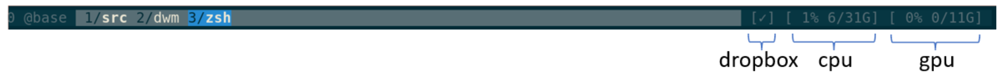
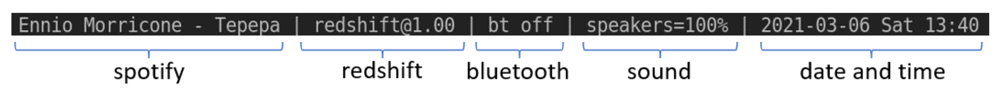

# ltstatus - a low-tec status lib in python

* [overview](#overview)
* [install and test](#install-and-test)
* [configuration](#configuration)
* [use with tmux](#use-with-tmux)
* [use with dwm](#use-with-dwm)
* [available monitors](#available-monitors)


# overview

`ltstatus` outputs status lines suitable for consumption by, eg, `tmux` or `dwm`:

* tmux (https://github.com/tmux/tmux/wiki) 
  (There are many fully-featured tmux status line frameworks out there.
  `ltstatus` only offers the part as annotated above.
  It _does not_ offer a full tmux status line framework.)

* dwm (https://dwm.suckless.org/) 

Shell scripting is a venerable alternative and can go a long way.
The internet is full of tutorials for `tmux` status lines, also for `dwm` and the like.
I have used that alternative for a long time.
Shell scripting can get tricky to maintain when the complexity increases.
As you start to tweak the details of what you see in the status line, you might want to try something else.

The main problem with a shell script was that if you wanted it to be reacting fast to changes,
then you had to refresh it very often, as in `while sleep 0.5s; do collect_and_outputs; done`.
But most status elements dont need much updating.
I wanted to minimize the updates:
_"date and time"_ should only update once a minute, while _"bluetooth"_ should update the millisecond a device has connected.
This should produce a real-time display while not using much cpu.
`ltstatus` was born out of this _non-epic_ struggle.

As it is typical for these kind of projects, I want to claim that `ltstatus` is light-weight, easy to hack, and guided by trying to stay minimal.
However, disclaimerly, the accuracy of that statement is relative at best.
Yet we all know that _relative_ is the best kind of accuracy!
`ltstatus` is useful to my workflow, and I also just enjoyed working on it :sunglasses:.


## install and test

Checkout and setup in a location of your choice:

```shell
git clone git@github.com:dkuettel/ltstatus.git
cd ltstatus
./setup
```

`./setup` should take care of everything (tested on an ubuntu 20.04):
- install apt-get dependencies
- setup python virtual env
- install python dependencies

As a small test, you can run `bin/ltstatus examples/test.py`, or just `./test`.
You should see some regular updates line by line on stdout.
As not all statuses might apply to your system, some maybe be showing as `...`.
Currently, you might even get an exception, as not all statuses reactly kindly to missing observables.
In that case, just go and disable the offendig status in `./examples/test.py`.

This is how it might look:
```
> bin/ltstatus examples/all.py
[...] [...] [...] [...] [...] [...] [...] [...] [2021-03-07 Sun 13:04]
[Spotify Premium] [redshift@1.00] [bt off] [speakers=100%] [✓] [ 0% 7/31G] [ 1% 1/11G] [2021-03-07 Sun 13:04]
[Spotify Premium] [redshift@1.00] [bt off] [speakers=100%] [✓] [ 0% 7/31G] [ 0% 1/11G] [2021-03-07 Sun 13:04]
...
```


## configuration

There are no dedicated configuration files.
A configuration is written as python code.
See `./examples/*` for inspiration.
Most should be clear from there, but the doc-strings in `./python/ltstatus/*` can also be useful.
The available statuses are found in `./python/ltstatus/monitors`, see their docstrings for details.
This is also where new monitors can be added.

With a custom configuration `lt-config.py` ready, it can be run using `bin/ltstatus lt-config.py`.
Add `./bin` to the path to make handling easier.
Especially convenient when using `#!ltstatus` at the beginning of an executable `lt-config.py`.

See below for concrete examples with `tmux` and `dwm`.

If you want to dive deeper, `./examples/test.py` is a good place to start.
You will notice there are two main kinds of monitors:
First, `ThreadedMonitor` is a real-time monitor that reacts immediately to state changes.
Usually it does so by using smart IO operations that block.
These monitors are typically grouped with a `RateLimitedMonitors` to make their updates responsive but prevent spamming.
Second, `CallbackMonitor`s, usually grouped with a `RegularGroupMonitor`, are updated in fixed intervals and do not react in real-time.

Note:
Within `lt-config.py` you have complete freedom.
Apart from setting up your `ltstatus` configuration,
you can also decide to parse input arguments (maybe using `click`),
if you want it to be configurable from the command line.
Often however it's easier to have separate `lt-config.py`s per use case.


## use with tmux

See `./examples/tmux-status.py` as a start for your own configuration:

```python
#!bin/ltstatus
from pathlib import Path

from ltstatus import RateLimitedMonitors, RegularGroupMonitor, StdoutStatus, monitors

monitor = RateLimitedMonitors(
    rate=1,
    monitors=[
        monitors.nvidia.Monitor(),
        monitors.dropbox.Monitor(),
        RegularGroupMonitor(
            interval=1,
            monitors=[
                monitors.cpu.Monitor(),
                monitors.diskspace_alerts.Monitor(
                    limits={
                        Path("/var/lib/docker"): 2.0,
                        Path("/"): 10.0,
                        Path("~"): 5.0,
                    },
                ),
            ],
        ),
    ],
)

status = StdoutStatus(
    monitor=monitor,
    order=[
        "diskspace-alerts",
        "dropbox",
        "cpu",
        "nvidia",
    ],
    separator=" ",
    prefix="[",
    postfix="]",
    waiting="...",
)

status.run()
```

Hopefully most things are obvious.
Note especially that `tmux` (as of around version `3.3`) does not update its status more than once a second.
Thus `rate=1` and `interval=1` in the configuration above.

Assuming you made your `tmux-status.py` executable as described in the previous section,
you can then test it within a tmux session:

```
tmux set-option status-right ' #(path/to/tmux-status.py) '
```

To make the change permanent,
add it to the tmux configuration file (`~/.tmux.conf`) with the `-g` switch:

```
tmux set-option -g status-right ' #(path/to/tmux-status.py) '
```


## use with dwm

Mostly the same as the above section for `tmux`.
See `./examples/dwm-status.py` as a start for your own configuration.

Note especially the use of `XsetrootStatus` instead of `StdoutStatus`.
This means you cant easily observe the stdout output for testing.
Replace it with `StdoutStatus` while testing.

Note also that `dwm` displays any update, unlike `tmux` that does it at most once second.
This means `RateLimitedMonitors(rate=30, ...)` produces realtime updates for, eg, _"bluetooth"_.


## available monitors

See docstrings in `./python/ltstatus/monitors/*.py` for details:

- bluetooth
- cpu
- datetime
- diskspace-alerts: Useful to be alerted when, eg, the docker cache or your home folder fills up.
- dropbox
- nvidia
- redshift
- sound
- spotify
