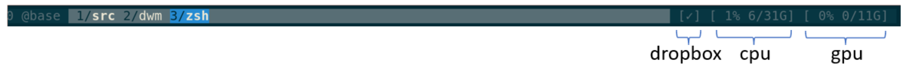
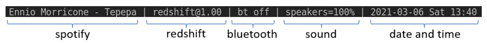

# ltstatus (v2.1.0)

`ltstatus` outputs status lines suitable for consumption by, eg, `tmux` or `dwm`, and other similar tools. `ltstatus` is written in python.

Examples:

* tmux (https://github.com/tmux/tmux/wiki) 
  (There are many fully-featured tmux status line frameworks out there.
  `ltstatus` only offers the part as annotated above.
  It _does not_ offer a full tmux status line framework.)

* dwm (https://dwm.suckless.org/) 


# install and test

Checkout and setup in a location of your choice:

```shell
git clone git@github.com:dkuettel/ltstatus.git
cd ltstatus
./setup
```

Checkout a specific tag if you need a reproducible setup.

`./setup` should take care of everything (tested on an ubuntu 20.04):
- install apt-get dependencies
- setup python virtual env
- install python dependencies

As a small test, you can run `bin/ltstatus examples/test.py`, or just `./test`.
You should see some regular updates line by line on stdout, this is how `tmux` consumes it.
As not all statuses might apply to your system, some maybe be showing as `...`.
Currently, you might even get an exception, as not all statuses reactly kindly to missing observables.
In that case, just go and disable the offendig status in `./examples/test.py`.

This is how it might look:
```
> bin/ltstatus examples/test.py
[...] [...] [...] [...] [...] [...] [...] [...] [2021-03-07 Sun 13:04]
[Spotify Premium] [redshift@1.00] [bt off] [speakers=100%] [✓] [ 0% 7/31G] [ 1% 1/11G] [2021-03-07 Sun 13:04]
[Spotify Premium] [redshift@1.00] [bt off] [speakers=100%] [✓] [ 0% 7/31G] [ 0% 1/11G] [2021-03-07 Sun 13:04]
...
```


# configuration

There are no dedicated configuration files.
A configuration is written as python code.
See `./examples` for inspiration, in particular `tmux-status.py` or `dwm-status.py`.
Most should be clear from there, but the doc-strings in `./python/ltstatus/*` can also be useful.
The available monitors are found in `./python/ltstatus/monitors/*`, see their docstrings for details.
This is also where new monitors can be added.

With a custom configuration ready, for example `tmux-status.py`, it can be run using `bin/ltstatus tmux-status.py`.
To make handling easier, add `./bin` to the path, or symlink `bin/ltstatus` into your path.
Especially convenient when using `#!/usr/bin/env ltstatus` at the beginning of an executable `tmux-status.py`.
If you drop the extension and make it executable, you can use it just as `./tmux-status`.

Note:
Within any of your `some-status.py` you have complete freedom.
Apart from setting up your `ltstatus` configuration,
you can also decide to parse input arguments (maybe using `click`),
if you want it to be configurable from the command line.
Often however it's easier to have separate `xyz-status.py`s per use case.


# use with tmux

See `./examples/tmux-status.py` as a start for your own configuration.
Assuming you made your `tmux-status.py` executable as described in the previous section,
you can then test it within a tmux session:

```
tmux set-option status-right ' #(path/to/tmux-status.py) '
```

To make the change permanent,
add it to the tmux configuration file (`~/.tmux.conf`) with the `-g` switch:

```
tmux set-option -g status-right ' #(path/to/tmux-status.py) '
```


# use with dwm

Mostly the same as the above section for `tmux`.
See `./examples/dwm-status.py` as a start for your own configuration.

Note especially the use of `outputs.dwm()` instead of `outputs.tmux()`.
This means you cant easily observe the stdout output for testing.
Replace it with `outputs.tmux()` while testing.

Note also that `dwm` displays any update, unlike `tmux` that does it at most once second.


# available monitors

See the respective classes `Monitor` in `./python/ltstatus/monitors/*.py` for details:

- bluetooth
- cpu
- datetime
- diskspace-alerts: Useful to be alerted when, eg, the docker cache or your home folder fills up.
- dropbox
- nvidia
- redshift
- sound
- spotify


# motivation

Shell scripting is a venerable alternative and can go a long way.
The internet is full of tutorials for `tmux` status lines, also for `dwm` and the like.
I have used that alternative for a long time.
Shell scripts can get tricky to maintain when the complexity increases.
As you start to tweak the details of what you see in the status line, you might want to try something else.

The main problem with a shell script was that if you wanted it to be reacting fast to changes,
then you had to refresh it very often, as in `while sleep 0.5s; do collect_and_outputs; done`.
But most status elements dont need much updating.
I wanted to minimize the updates:
_"date and time"_ should only update once a minute, while _"bluetooth"_ should update the millisecond a device has connected.
Similarly _"spotify"_ should change the status the moment the song changes.
This should produce a real-time display while not using much cpu.
`ltstatus` was born out of this _non-epic_ struggle.

I want to claim that `ltstatus` is light-weight and easy to hack:

- light-weight: No busy threads, all is done with blocking syscalls when there is waiting involved.
  However, it is not currently implemented using any async features of python.

- easy to hack: This was a bit of an exercise for me to try and write code that is easy to understand for a fresh reader.
  If you want to get into the code, start with `python/ltstatus/__init__.py:run`
  If you want to adapt or create a new monitor, start with one of the shorter monitors in `python/ltstatus/monitors`.

`ltstatus` is useful to my workflow, and I also just enjoyed working on it :sunglasses:.


# versioning

Note that this project is using semantic versioning.
We consider the following python references as part of the public interface:

- `ltstatus.run`
- `ltstatus.formats.*`
- `ltstatus.outputs.*`
- `ltstatus.monitors.*`

However, when it comes to individual monitors,
versioning might be applied a bit more loosely.

Versions are tagged `vMAJOR.MINOR.PATCH`.
The current `v2.x.x` public interface has breaking changes with respect to `v1.x.x`.


# releases

releases:
- `v2.1.0` split up cpu into cpu & cores
- `v2.0.1` improve spotify and other monitors
- `v2.0.0` flatter public interface
- `v1.1.3` fix spotify monitor
- `v1.1.2` internal fixes
- `v1.1.1` minor fixes
- `v1.1.0` new monitor
- `v1.0.0` initial release
